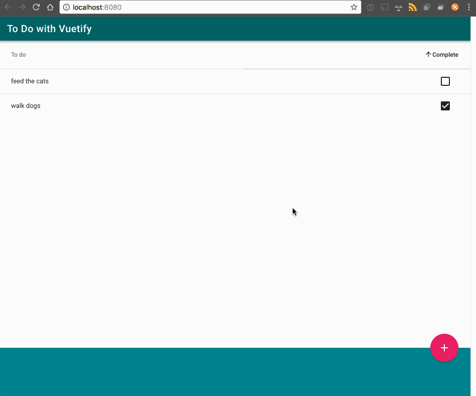
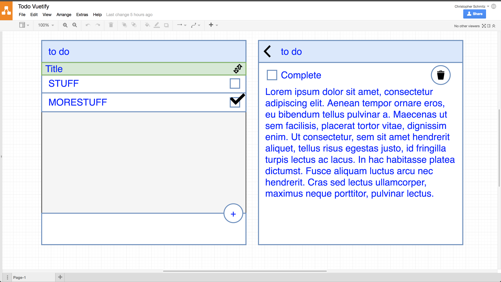

# Hello World-ing with Vuetify

> A Vue.js + Vuetify exploration



I'm planning on using vuetify on an upcoming project at work. To get my feet wet I wireframed out a quick todo ...



and then built it out.

I'm not trying to learn the in's and out's of vue itself so I wasn't really worried about replicating everything from the ToDoMVC outline or even break break out stuff into isolated components. This is really just "how can I get the visual I want using vuetify and let me get a bit of practice navigating its documentation".

All in all I think it went well :)


## Build Setup

``` bash
# install dependencies
npm install

# serve with hot reload at localhost:8080
npm run dev
```